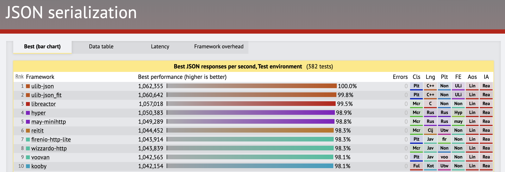

# pohjavirta

Fast & Non-blocking Clojure wrapper for [Undertow](http://undertow.io/).

**STATUS:** Pre-alpha, in design and prototyping phase.

<a href="https://www.techempower.com/benchmarks/#section=test&runid=42f65a64-69b2-400d-b24e-20ecec9848bc&hw=ph&test=json"></a>

## Latest version

[](http://clojars.org/metosin/pohjavirta)

## Usage

```clj
(require '[pohjavirta.server :as server])
(require '[jsonista.core :as j])

(defn handler [_]
  {:status 200
   :headers {"Content-Type" "application/json"}
   :body (j/write-value-as-bytes {:message "hello"})})

;; create and start the server
(-> #'handler server/create server/start)
```

By default, the server listens to `localhost` on port `8080`. Trying with [HTTPie](https://httpie.org/):

```bash
➜  ~ http :8080
HTTP/1.1 200 OK
Content-Length: 19
Content-Type: application/json
Date: Sun, 29 Sep 2019 17:50:17 GMT
Server: pohjavirta

{
    "message": "hello"
}
```

Let's run some load with [wrk](https://github.com/wg/wrk):

```bash
➜  ~ wrk -t2 -c16 -d10s http://127.0.0.1:8080
Running 10s test @ http://127.0.0.1:8080
  2 threads and 16 connections
  Thread Stats   Avg      Stdev     Max   +/- Stdev
    Latency   106.47us   52.47us   3.20ms   98.73%
    Req/Sec    70.89k     2.49k   75.84k    79.21%
  1424471 requests in 10.10s, 199.70MB read
Requests/sec: 141036.08
Transfer/sec:     19.77MB
```

Async responses, using [promesa](http://funcool.github.io/promesa/latest/):

```clj
(require '[promesa.core :as p])

(defn handler [_]
  (-> (a/promise {:message "async"})
      (a/then (fn [message]
                {:status 200,
                 :headers {"Content-Type" "application/json"}
                 :body (j/write-value-as-bytes message)}))))
```

We redefined the handler, so no need to restart the server:

```bash
➜  ~ http :8080
HTTP/1.1 200 OK
Content-Length: 19
Content-Type: application/json
Date: Sun, 29 Sep 2019 18:00:35 GMT
Server: pohjavirta

{
    "message": "async"
}
```

Performance is still good:

```bash
➜  ~ wrk -t2 -c16 -d10s http://127.0.0.1:8080
Running 10s test @ http://127.0.0.1:8080
  2 threads and 16 connections
  Thread Stats   Avg      Stdev     Max   +/- Stdev
    Latency   106.86us   33.93us   2.15ms   94.69%
    Req/Sec    70.41k     2.38k   78.25k    76.24%
  1414188 requests in 10.10s, 198.26MB read
Requests/sec: 140017.14
Transfer/sec:     19.63MB
```

## Status

WIP. See [issues](https://github.com/metosin/pohjavirta/issues) for Roadmap.

## License

Copyright © 2019 [Metosin Oy](http://www.metosin.fi)

Distributed under the Eclipse Public License, the same as Clojure.
